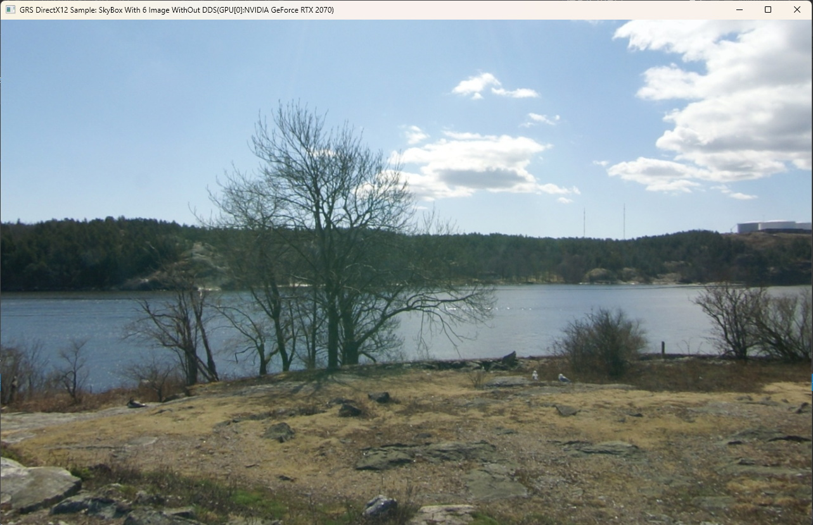
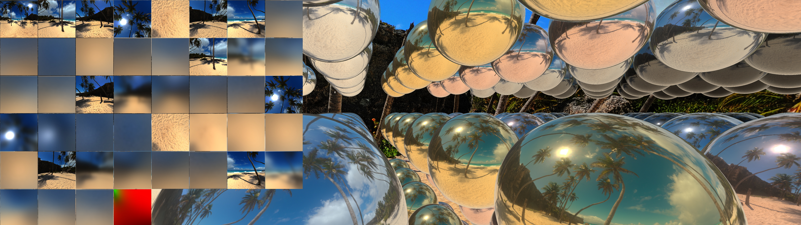
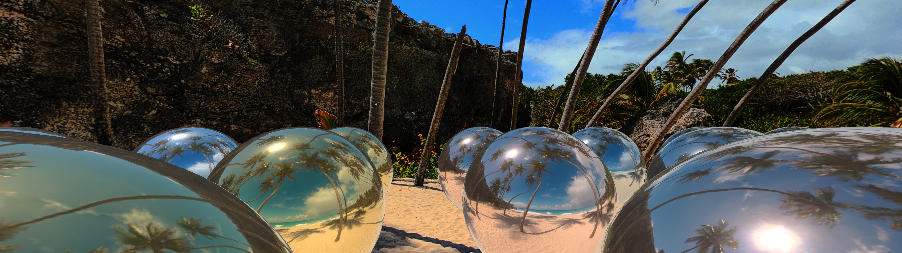
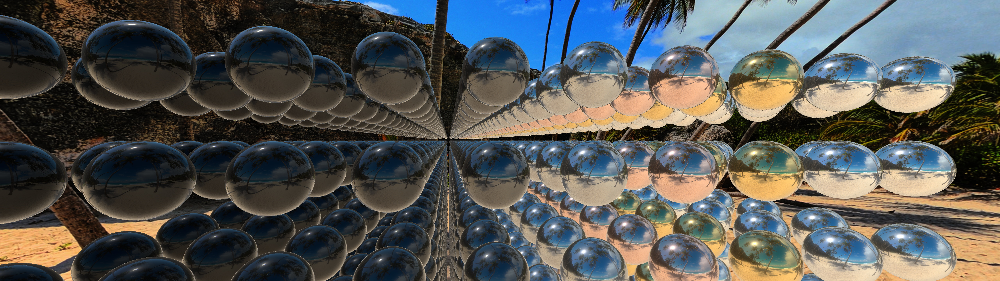
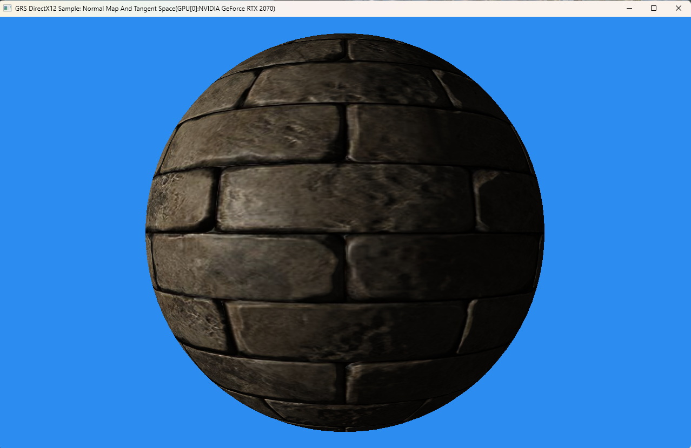
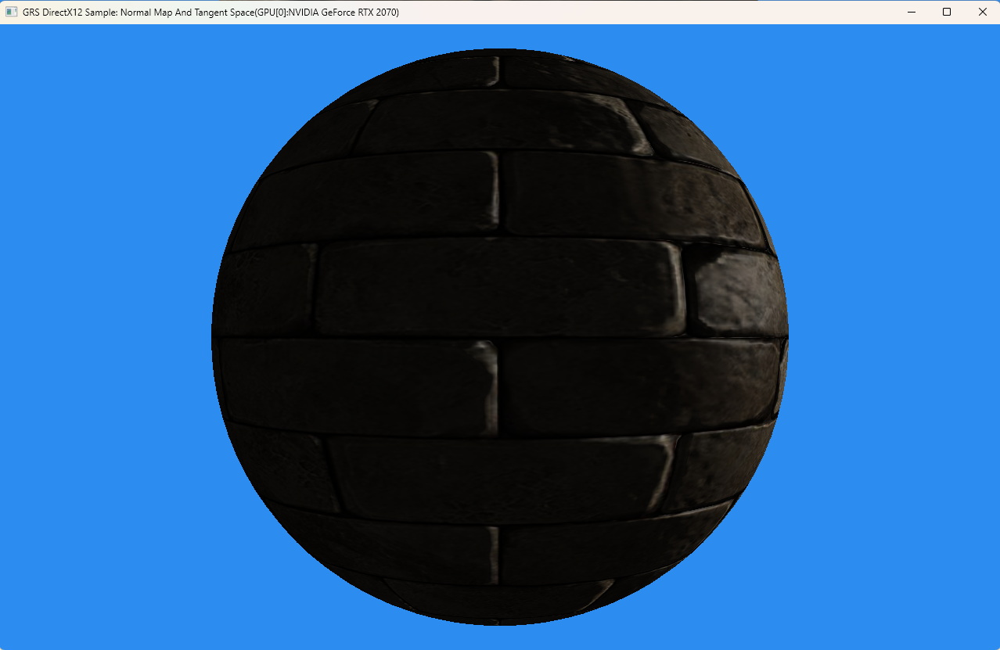

# Gamebaby Rock Sun's D3D12 C-Style Sample Code for beginner

&emsp;&emsp;整个项目使用VS2019构建，请自行安装VS2019打开sln文件。

&emsp;&emsp;关于这些示例的详细讲解请到我的CSDN博客查看： https://blog.csdn.net/u014038143 

&emsp;&emsp;教程中的代码跟现在这个项目中的代码有些出入，示例代码请以这里为准。

&emsp;&emsp;这套示例代码的目标就是不使用任何封装，并且使用比较原始的C-风格代码来展示D3D12编程的方方面面。不使用任何封装使大家更集中精力于D3D12本身，而不至于分散注意力。并且线性化（甚至连独立的函数都没有怎么封装）的代码风格有助于大家学习和理解D3D12，根本目的就在于让大家彻底理解和消化D3D12本身。当彻底搞明白D3D12接口之后，各位想怎么封装就怎么去封装吧。那才是真正的自由王国！

# 1、1-D3D12Triangle

&emsp;&emsp;这个例子相当于Hello World，只是简单的绘制一个三角形出来；

# 2、2-D3D12WICTexture

&emsp;&emsp;这个例子演示如何使用WIC加载一个图片纹理，重点在于搞明白D3D12中的纹理加载的过程，理解“两次Copy”操作的基本过程（请注意代码中的注释说明），这是理解D3D12资源加载的基础。

# 3、3-PlacedTexture

&emsp;&emsp;这个示例效果上与第二个示例一样，该示例中主要展示的是使用D3D12中的Placed（定位方式）的Texture，重点在于自建显存堆/共享内存堆的创建和使用上。

# 4、4-D3D12TextureCube

&emsp;&emsp;这个例子主要展示DirectXMath库基本操作方法、使用独立堆创建常量缓冲、理解管线状态对象、理解围栏同步等内容，并且开始绘制一个真正的3D立方体。

# 5、5-SkyBox

&emsp;&emsp;这个例子主要让大家学会使用和理解捆绑包，并且开始学会加载并使用DDS Cube Map。

# 6、6-MultiThread

&emsp;&emsp;这个示例是比较重要的一个例子，展示了如何进行多线程渲染，本质上就是使用多个线程和多个CommandList来记录渲染命令。这个例子只是简单的搭起了一个多线程渲染的基本框架而已，这种简单性的目的就是方便大家彻底掌握多线程渲染。

# 7、7-D3D12MultiAdapter

&emsp;&emsp;这个示例主要展示如何充分利用系统中的多个显卡来进行渲染，主要是演示异构多显卡渲染，比较典型的可以应用于有独显及核显的笔记本系统，这样的系统比较常见。核心就是跨显卡共享纹理，不能共享纹理，最差也能够共享缓冲Buffer，这是D3D12的基本要求。

# 8、8-UIRenderBase

&emsp;&emsp;这个示例主要演示了基本的UI渲染图片的正交投影变换矩阵的生成，图片的Alpha Blend 显示，以及基本的划线操作等。

# 9、9-D3D12RenderToTexture

&emsp;&emsp;这个示例主要展示在D3D12中如何渲染到纹理。渲染到纹理是很重要的一个方法，是很多渲染特效需要的基本功能。

# 10、10-PixelShaderTips

&emsp;&emsp;这个示例主要演示了一些很古老的仿照Photoshop中的滤镜效果的Pixel Shader在D3D12中的实现。其中的方法都还没有优化，只是做到了将公式直接翻译成Shader的工作。

# 11、11-MultiThreadAndAdapter

&emsp;&emsp;这个示例主要为了在前一个例子基础上正确实现水彩画效果，需要后渲染的高斯模糊处理，同时该示例主要展示了多线程+多显卡渲染的基本方法，并且将高斯模糊后处理主要丢到了辅助显卡上去执行。同时该示例中的高斯模糊就是经典的两遍渲染来实现了，效率上比前一个例子中的“九宫格”方式的实现高了近50%，GPU占用从40%-50%降到了20%左右。

# 12、12-D2DWriteOnD3D12

&emsp;&emsp;这个示例主要展示在多线程多显卡渲染架构的基础上再融入D2D和DWrite，这样方便显示一些文字信息，为性能考虑有意将D2D和DWrite放在了辅助显卡（一般是核显）上来执行，这样主显卡就专心去做渲染的工作。

# 13、13-ShowGIFAndResourceStatus

&emsp;&emsp;这个示例主要展示如何使用WIC加载GIF动画图片，同时当做纹理来显示。GIF动画的处理主要使用到了Direct Computer作为预处理管线。重点就是展示使用Direct Computer来做纹理图片的预处理的技术，这是一个很重要的基本技巧。这个例子由将基本框架回复到了单线程单显卡渲染的基础上。重点是演示现代显卡的多引擎架构，即有3D引擎、计算引擎，可以同时创建多个分别代表这些引擎的命令队列，并演示了多个引擎间同步的方法。

# 14、14-MultiThreadShadow

&emsp;&emsp;该示例主要展示使用多线程渲染时，如何进行多线程多Pass组合渲染来显示阴影。其中的渲染到深度缓冲的方法是一个十分重要的方法，是现代比较流行的延迟渲染、Forward+等渲染技术的核心基础技术之一。（该示例还在开发中，完成后提交并进一步补充文档及运行截屏）。

# 15、15-CPUThreadsBarrier

&emsp;&emsp;该示例是一个纯的只使用了命令行的用于演示“3个内核同步对象实现渲染线程池/大规模线程池”的例子代码，为了大家能够掌握这种专门的用于渲染线程池的框架原理，这个示例中把所有真实的D3D12渲染的代码都删除掉了，只是保留了简单的命令行输出提示，代表插入真实渲染代码的位置。运行后的效果如下：

# 16-Assimp_Data_Display

&emsp;&emsp;该示例基于命令行格式化的显示了Assimp导入模型的数据及数据结构，让大家先对模型数据有一个感性的认识，好进一步掌握3D骨骼动画的原理及运用方法。

# 17-D3D12_Assimp_Animation

&emsp;&emsp;该示例展示了使用Assimp导入动画文件，并用基本的D3D12渲染框架渲染，还没有加任何的光照效果，只是简单的展示3D骨骼动画的基本原理。

# 18-PBR-Base-Point-Lights

&emsp;&emsp;该示例展示基础的PBR渲染过程，重点在PS_PBR_Base_Point_Lights.hlsl文件中。基于物理的渲染（PBR）是现代渲染的主流技术，与传统光照纯几何式的光照渲染方式已经大相径庭，本系列示例即直接跳过传统光照，直接进入现代化的PBR渲染的学习与展示。本例中用了8个点光源，照明了一个球体，使用了PBR中比较流行的“金属工作流”渲染模型，即主要材质参数是金属度、粗糙度、反射率等，其中反射率模拟了8种金属，可以使用Tab键切换反射率，用A、Q键对-控制金属度、W、E键对-控制粗糙度、E、D键对-控制环境遮挡系数。由于使用的是点光源，这个示例在纯金属最低粗糙度时，仅有高光点，这其实是不对的。例子的真实目的是给大家展示基本的PBR光照方程变成代码的样子。最终需要注意的是，学习D3D12接口编程的终极目的是掌握现代渲染算法和技术，因此后续的例子都希望大家对前面各个例子中的一些D3D12基本操作都有了牢固的掌握，或者说D3D12本身不应再成为大家学习的障碍，而是一个有力的工具！如果前序例子还有疑问或者我可能没有交代清楚的细节，大家都可以随时到本人博客：[Gamebaby Rock Sun的博客](https://blog.csdn.net/u014038143?spm=1000.2115.3001.5343) 留言提问。本示例运行效果截图如下（一个略显粗糙的金色金属球，可以通过按键调整至此效果）：

# 22-MultiInstance-PBR-Sphere

&emsp;&emsp;这个示例是18号示例的自然延续，使用了多实例技术来呈现PBR的球体阵列，可以更加直观的看到金属流形式的虚拟物理参数对PBR效果细腻的影响。效果如下：

# 23-Structured_Empty

&emsp;&emsp;这个示例是将之前示例中过多的变量进行了分类整理，比做了初步结构化封装，注意这不是教大家如何封装，而是为了后续的例子编写和学习的方便性，不再用去过多的记忆太多的变量及用途，而是分门别类放在结构体里，方便大家理解和学习。需要注意的是，这并不是估计大家封装的做法，因为这里用结构体封装了对象，这是一般封装思路中的大忌，所以在真实的项目代码中，大家一定要使用类来封装成员对象，结构体就是结构体，不要有函数，一般也不要有对象成员，否则后续代码会变得很诡异，而且理解和修改也是极其麻烦的。我将这个原则叫做 C/C++ style 分离（代码风格分离，不要用C写类似C++风格的代码，更不要用C++写类似C风格的代码）。

# 24-CubeMapWithoutDDS

&emsp;&emsp;这个示例是个过渡示例，重点是让大家理解 Cube Map 或者说 Skybox（天空盒）纹理的构造，及单独每个面图片的创建和加载方法，也是为了让大家未来彻底丢掉DDS纹理做铺垫，因为DDS的来源较少，并且修改和使用也不直观，作为学习来说 DDS 格式本身就已经“过渡封装”了，非常不利于大家理解和掌握纹理操作的本质。另外这个示例也是为之后的 IBL 渲染做好铺垫，因为IBL渲染中有大量的Texture操作，尤其是有大量的 Cube Map 操作，如果不能很好的理解 Cube Texture 的构造及创建等相关操作方法的话，就几乎无法理解 IBL 的根本原理。

# 25-IBL-MultiInstance-Sphere

&emsp;&emsp;这个示例是基于IBL（Image-Based Lighting）的 PBR 无材质纹理、无法线贴图等的基本示例。因为IBL本身处理过程的复杂性，用到了很多预积分计算，同时 HDR Image 体积也较大，为了能达到演示的最佳效果，建议在**显卡配置不够时，尽量不要运行这个示例**。如果机器配置较低，并要运行，**请尽量调低几个参数**：一个是在 GRS_PBR_Function.hlsli 中的 GRS_INT_SAMPLES_CNT 调至 1024 或更低的值，以减少积分计算的量，另外运行中选择 HDR 光照图，和天空盒背景图时，请选择较低分辨率的小体积图片，从而使示例能够运行而不用耗费过多资源。若要看比较好的效果，在显卡条件够的情况下（推荐RTX2070及以上）需要反过来做，积分采样次数可以调至4096或更高，以消除摩尔纹，并达到更佳的效果。

&emsp;&emsp;HDR 图片来自：[sIBL Archive (hdrlabs.com)](http://www.hdrlabs.com/sibl/archive.html) ，非常感谢 hdrlabs 的慷慨奉献！

&emsp;&emsp;示例中还用到stb库，为了简化Git操作，直接复制了一份在项目中，stb源地址在：[https://github.com/nothings/stb.git](https://github.com/nothings/stb.git) ,在此表示感谢！

&emsp;&emsp;示例中关于解算等距柱状纹理贴图的最终修正算法，来自一位不愿公开信息的网友，在此表示感谢！

&emsp;&emsp;示例整体主要参考了：

[漫反射辐照 - LearnOpenGL CN (learnopengl-cn.github.io)](https://learnopengl-cn.github.io/07 PBR/03 IBL/01 Diffuse irradiance/)

[镜面IBL - LearnOpenGL CN (learnopengl-cn.github.io)](https://learnopengl-cn.github.io/07 PBR/03 IBL/02 Specular IBL/)

等文章，在此表示感谢！

&emsp;&emsp;示例中引用的 HDR_COLOR_CONV.hlsli 来自微软示例：[microsoft/DirectX-Graphics-Samples](https://github.com/microsoft/DirectX-Graphics-Samples) ，处理颜色空间转换，尤其是 Gamma 矫正时推荐使用这个头文件。在此也表示感谢！

&emsp;&emsp;**郑重声明：若因您贸然运行该示例而导致显卡损坏或设备损坏等，与本人无关！** 

# 26-Normal-Map-And-Tangent-Space

&emsp;&emsp;这个示例主要演示了经典的法线贴图的基本操作，并且演示了如何利用顶点的法线和切线属性生成正确的切线空间，并在 Pixel Shader 中正确的变换逐顶点法线。这是非常常用和基础的一项操作，学习并掌握好它，是将来应对和实现更高级复杂的光照渲染模型的基础。这也是为了后续的 PBR 带材质渲染示例做准备，以方便各位平滑的阅读下一个示例。

&emsp;&emsp;再次强调一下，这套示例主要是为了演示D3D12的一些基本调用方法以及基本Shader编写的，不是介绍任何引擎框架或渲染框架及相关封装知识的。所有示例都基本保持C-Style风格的编写，并且代码集中编写，是为了方便各位阅读理解并掌握好基础技能的。因此也请各位不要过于纠结示例代码中的那些蹩脚的封装或者不严格的一些定义，这些只是为了方便组织代码而引入的东西，并没有暗示或示范说如何进行封装的内容，其本身并没有价值也没有意义，千万不要随便使用它们在你的任何正式项目中，以防发生意外，请一定关注每个示例主要向你展示的内容即可。
